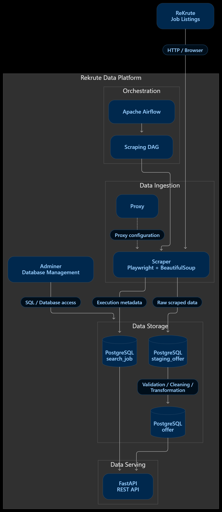
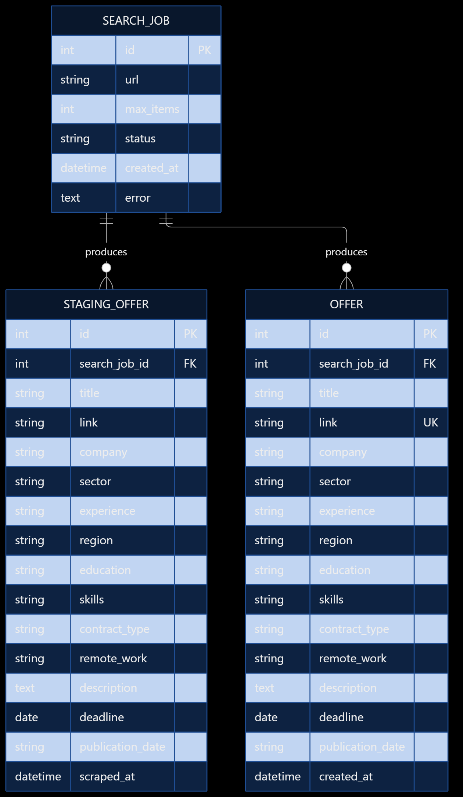
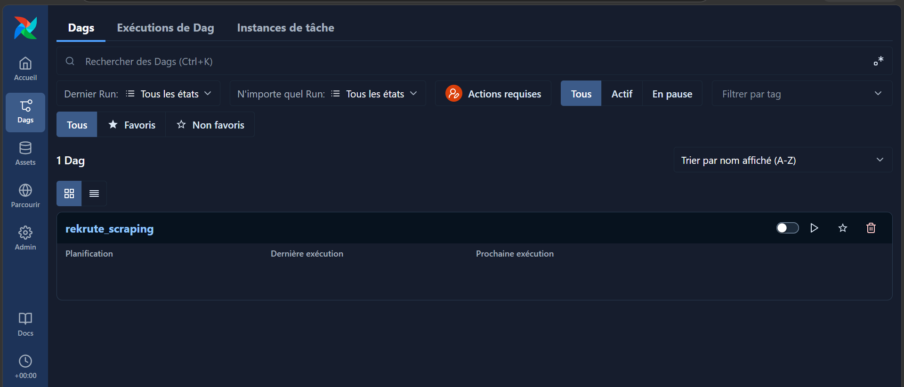
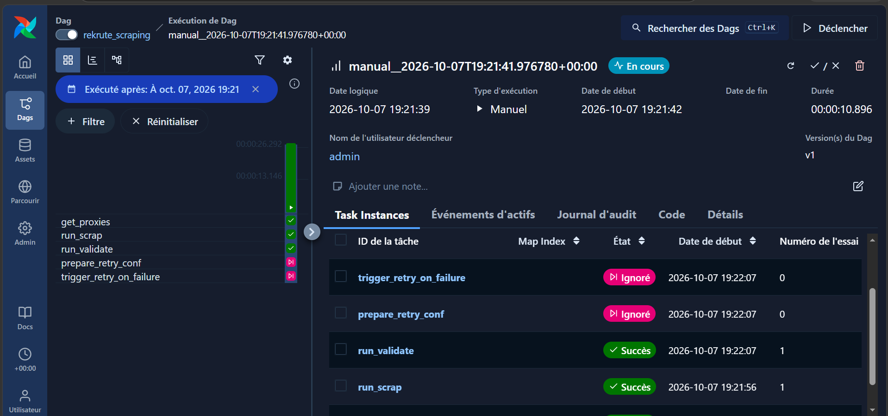
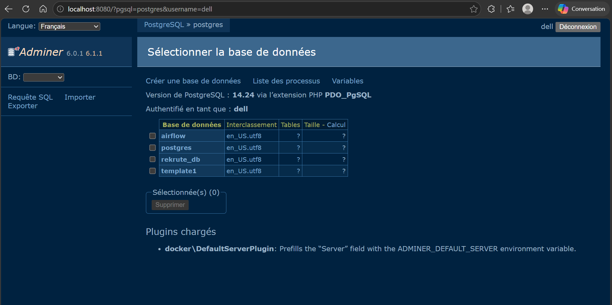
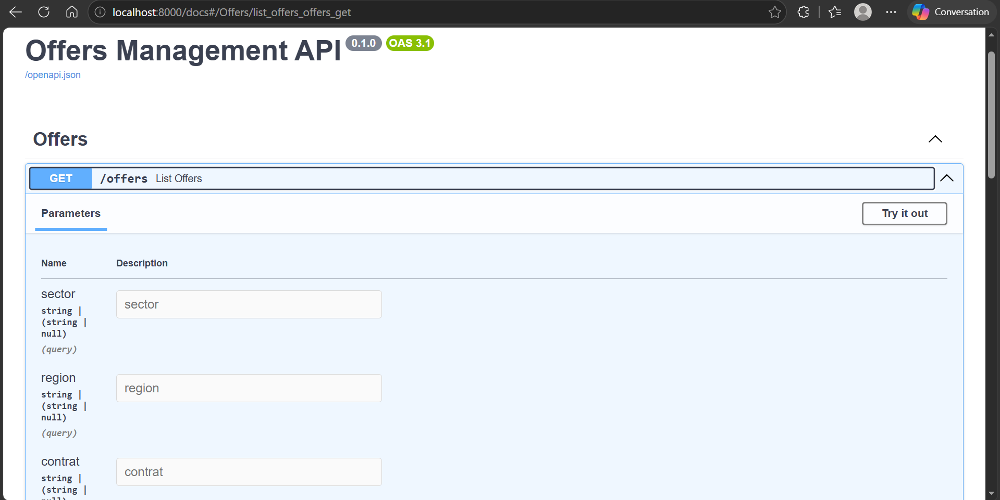

# Rekrute Data Platform

> End-to-end data platform for collecting, processing, validating and serving job offers from **ReKrute**.


---

## Overview

**Rekrute Data Platform** is a personal data-engineering project designed to build a reproducible pipeline around job offers published on [ReKrute](https://www.rekrute.com/).

The platform separates the different responsibilities of the system:

- **Scraping** — collect job offers from ReKrute using Playwright and BeautifulSoup.
- **Orchestration** — schedule and execute data workflows with Apache Airflow.
- **Storage** — persist raw/staging data and normalized offers in PostgreSQL.
- **API** — expose the collected job data through a FastAPI service.
- **Infrastructure** — run the complete stack locally with Docker Compose.
- **Observability / operations** — keep search executions, statuses and errors traceable in the database.

The project is intended as an evolving data platform. The architecture is designed so that additional transformations, data-quality rules and AI-assisted processing can be added without coupling them directly to the scraper.

---

## Architecture

The platform follows a simple ingestion → staging → processing → serving architecture.

```text
                         ┌──────────────────────┐
                         │       ReKrute        │
                         │    Job Listings      │
                         └──────────┬───────────┘
                                    │
                                    │ HTTP / Browser
                                    ▼
                         ┌──────────────────────┐
                         │       Scraper        │
                         │ Playwright + BS4     │
                         └──────────┬───────────┘
                                    │
                                    ▼
                         ┌──────────────────────┐
                         │      PostgreSQL      │
                         │                      │
                         │   staging_offer      │
                         └──────────┬───────────┘
                                    │
                              transformation
                                    │
                                    ▼
                         ┌──────────────────────┐
                         │        offer         │
                         │ normalized / final   │
                         └──────────┬───────────┘
                                    │
                                    ▼
                         ┌──────────────────────┐
                         │       FastAPI        │
                         │       REST API       │
                         └──────────────────────┘

                ┌────────────────────────────────────┐
                │          Apache Airflow            │
                │  DAGs / scheduling / orchestration │
                └────────────────────────────────────┘
```

### Architecture image

<p align="center">
  
</p>


Recommended file:

```text
docs/
└── images/
    └── architecture.png
```

---

## Main Features

### 1. Job scraping

The scraping layer uses:

- **Playwright** for browser automation and page interaction.
- **BeautifulSoup** for HTML parsing.
- **SQLModel / PostgreSQL** for persistence.
- Proxy support for controlled scraping workflows.

The extracted information includes fields such as:

- Job title
- Job URL
- Sector
- Experience
- Region
- Education / training
- Personal skills
- Contract type
- Remote-work information
- Description
- Application deadline
- Publication date
- Scraping timestamp

---

### 2. Airflow orchestration

Apache Airflow is used as the orchestration layer.

The pipeline is containerized and includes:

- DAG processing
- Scheduling
- API server
- Database migration
- Workflow execution
- PostgreSQL-backed Airflow metadata

The project uses a dedicated Airflow image built from:

```text
apache/airflow:3.3.2
```

The image installs Playwright and Chromium so browser-based scraping can run directly inside the workflow environment.

---

### 3. Staging and final data layers

The database separates scraped data from the final dataset.

#### `search_job`

Tracks scraping/search executions.

| Column | Description |
|---|---|
| `id` | Search identifier |
| `url` | URL used for the search |
| `max_items` | Maximum number of requested items |
| `status` | Execution status |
| `created_at` | Creation timestamp |
| `error` | Error information when applicable |

#### `staging_offer`

Contains offers collected by the scraping stage before final processing.

This layer makes it possible to keep ingestion independent from later transformation and validation logic.

#### `offer`

Contains the final normalized job offers.

The job URL is unique, which helps prevent duplicate final records.

---

## Data Flow

A typical execution follows this process:

```text
1. Search request
       │
       ▼
2. Create search_job
       │
       ▼
3. Airflow triggers scraping task
       │
       ▼
4. Playwright opens ReKrute
       │
       ▼
5. HTML is parsed
       │
       ▼
6. Raw extracted offers → staging_offer
       │
       ▼
7. Validation / cleaning / transformation
       │
       ▼
8. Normalized records → offer
       │
       ▼
9. Data exposed through FastAPI
```

This separation allows the scraping process and data-processing process to evolve independently.

---

## Project Structure

The repository is organized around three main components:

```text
Rekrute-data-platform/
│
├── api/
│   ├── Dockerfile
│   ├── requirements.txt
│   └── ...
│
├── pipeline/
│   ├── Dockerfile
│   ├── requirements.txt
│   ├── dags/
│   ├── db/
│   ├── services/
│   ├── sources/
│   └── config.py
│
├── scraper/
│   ├── requirements.txt
│   └── ...
│
├── docker-compose.yml
├── init.sql
├── .gitignore
└── README.md
```

### `api/`

FastAPI application responsible for exposing the data platform through HTTP endpoints.

### `pipeline/`

Airflow-based orchestration layer containing:

- DAGs
- database-related code
- services
- data sources
- configuration

### `scraper/`

Scraping-related code and dependencies.

### `docker-compose.yml`

Defines the complete local infrastructure, including:

- PostgreSQL
- Adminer
- FastAPI API
- Airflow migration
- Airflow API server
- Airflow DAG processor
- Airflow scheduler

---

## Technology Stack

| Area | Technology |
|---|---|
| Language | Python |
| Web API | FastAPI |
| Database | PostgreSQL 14 |
| ORM / Models | SQLModel |
| Scraping | Playwright |
| HTML parsing | BeautifulSoup |
| Orchestration | Apache Airflow 3.3.2 |
| Browser | Chromium |
| Containerization | Docker / Docker Compose |
| Database UI | Adminer |
| Database driver | psycopg |

---

## Prerequisites

Before running the project, make sure you have:

- Docker
- Docker Compose
- Git

No local Python installation is required when running the complete stack through Docker.

---

## Configuration

The project expects environment variables for PostgreSQL, Airflow and proxy-related configuration.

Create a `.env` file at the project root.

Example:

```env
POSTGRES_USER=postgres
POSTGRES_PASSWORD=your_password
POSTGRES_DB=offers

FERNET_KEY=your_fernet_key
AIRFLOW__API_AUTH__JWT_SECRET=your_airflow_jwt_secret

PROXY_USERNAME=your_proxy_username
PASSWORD=your_proxy_password
```

> Never commit real passwords, proxy credentials, API keys or other secrets to Git.

The Docker Compose configuration also uses a database password secret:

```text
db_password.txt
```

Keep this file local and make sure it is excluded from version control.

---

## Running the Project

### 1. Clone the repository

```bash
git clone https://github.com/noureddineFatimi/Rekrute-data-platform.git
cd Rekrute-data-platform
```

### 2. Configure environment variables

Create the required `.env` file and the local database password secret.

For example:

```text
.env
db_password.txt
```

### 3. Start the platform

```bash
docker compose up --build
```

The first startup may take some time because Docker needs to build the API and Airflow images and install the required Python and browser dependencies.

### 4. Run in detached mode

```bash
docker compose up --build -d
```

### 5. Check running services

```bash
docker compose ps
```

### 6. Stop the platform

```bash
docker compose down
```

To also remove persisted PostgreSQL data:

```bash
docker compose down -v
```

> `docker compose down -v` deletes the PostgreSQL Docker volume. Use it only when you intentionally want to reset the database.

---

## Services

The default Docker Compose setup exposes the following services:

| Service | Port | Purpose |
|---|---:|---|
| PostgreSQL | `5432` | Main database |
| Adminer | `8080` | Database management UI |
| FastAPI | `8000` | REST API |
| Airflow | `8081` | Airflow web/API interface |

### FastAPI

After startup:

```text
http://localhost:8000
```

FastAPI's interactive documentation is normally available at:

```text
http://localhost:8000/docs
```

### Adminer

Open:

```text
http://localhost:8080
```

Typical connection parameters from inside the Docker network:

```text
System:   PostgreSQL
Server:   postgres
Port:     5432
Username: <POSTGRES_USER>
Password: <POSTGRES_PASSWORD>
Database: <POSTGRES_DB>
```

### Airflow

Open:

```text
http://localhost:8081
```

The exact authentication configuration depends on the Airflow version and the credentials configured for the environment.

---

## Database Schema

The initial database setup creates the following main tables:

```text
search_job
    │
    ├───────────────┐
    │               │
    ▼               ▼
staging_offer      offer
```

### `search_job`

Represents a scraping/search execution.

### `staging_offer`

Temporary/staging representation of scraped offers.

### `offer`

Final representation of normalized offers.

The final `offer.link` field is unique, providing a database-level protection against duplicate URLs.

### Database diagram

A database diagram can be added here once generated:

<p align="center">
  
</p>

---

## Screenshots

The README intentionally leaves space for a few screenshots that are useful when presenting the project on GitHub.

### Airflow DAG





### Airflow execution



### Database / Adminer



### API documentation



### Recommended `docs/images` directory

```text
docs/
└── images/
    ├── architecture.png
    ├── database-schema.png
    ├── airflow-dag.png
    ├── airflow-run.png
    ├── adminer.png
    └── fastapi-docs.png
```

You do **not** need to add all of these screenshots. For a clean portfolio repository, the most valuable three are usually:

1. Architecture
2. Airflow DAG
3. FastAPI / database result

---

## Development

### API dependencies

The API uses:

```text
fastapi
sqlmodel
psycopg
python-dotenv
pylint
```

The API Docker image runs Uvicorn on:

```text
0.0.0.0:8000
```

### Pipeline dependencies

The Airflow image includes:

```text
apache-airflow
playwright
beautifulsoup4
sqlmodel
psycopg
python-dotenv
pylint
```

Chromium is installed inside the Airflow image to support browser automation.

---

## Data Engineering Principles

The project is designed around several data-engineering principles.

### Separation of concerns

Scraping, orchestration, storage and API serving are separated into different components.

### Staging layer

Scraped data first enters a staging table instead of being written directly to the final dataset.

This makes it easier to:

- validate data
- clean inconsistent fields
- debug scraping problems
- reprocess records
- add future transformations

### Traceability

Search executions are represented by `search_job`, while scraped records reference their corresponding search.

This makes it possible to associate an offer with the workflow execution that produced it.

### Reproducibility

The infrastructure is containerized with Docker Compose so the same stack can be reproduced locally without manually installing every dependency.

---

## Future Improvements

The platform is designed to evolve beyond basic scraping.

Potential next steps include:

- [ ] Add stronger data-quality validation rules
- [ ] Add automated deduplication and normalization
- [ ] Introduce **dbt** transformations
- [ ] Add incremental ingestion strategies
- [ ] Improve retry and failure handling
- [ ] Add monitoring and pipeline metrics
- [ ] Add automated tests for scraping and transformation logic
- [ ] Add CI/CD
- [ ] Add a data visualization dashboard
- [ ] Add AI-assisted data cleaning and classification
- [ ] Extract and analyze job-market skills
- [ ] Build historical analytics for job offers
- [ ] Add more Moroccan job sources

---

## Responsible Scraping

This project is intended for educational and personal data-engineering purposes.

When running the scraper:

- Respect the target website's terms and policies.
- Avoid excessive request rates.
- Use reasonable concurrency.
- Do not collect sensitive personal information unnecessarily.
- Keep credentials and proxy information private.
- Consider `robots.txt` and applicable legal requirements before deploying or scaling the scraper.

---

## Why This Project?

The goal of this project is not simply to scrape job offers.

It demonstrates how to design an end-to-end data platform where:

```text
Web source
    ↓
Data extraction
    ↓
Workflow orchestration
    ↓
Staging
    ↓
Validation / transformation
    ↓
Final dataset
    ↓
API / analytics
```

It therefore combines several areas of modern software and data engineering:

**Web Scraping · Data Engineering · ETL/ELT · Workflow Orchestration · PostgreSQL · REST APIs · Docker · Data Quality**

---

## Author

**Noureddine El Fatimi**

Software Engineer & AI Specialist

- GitHub: [@noureddineFatimi](https://github.com/noureddineFatimi)
- Project: [Rekrute Data Platform](https://github.com/noureddineFatimi/Rekrute-data-platform)

---

## License

This project is a personal project intended for educational and portfolio purposes.
